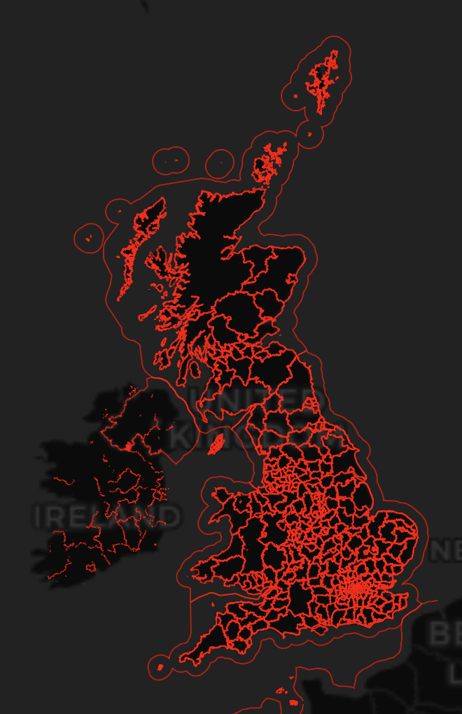
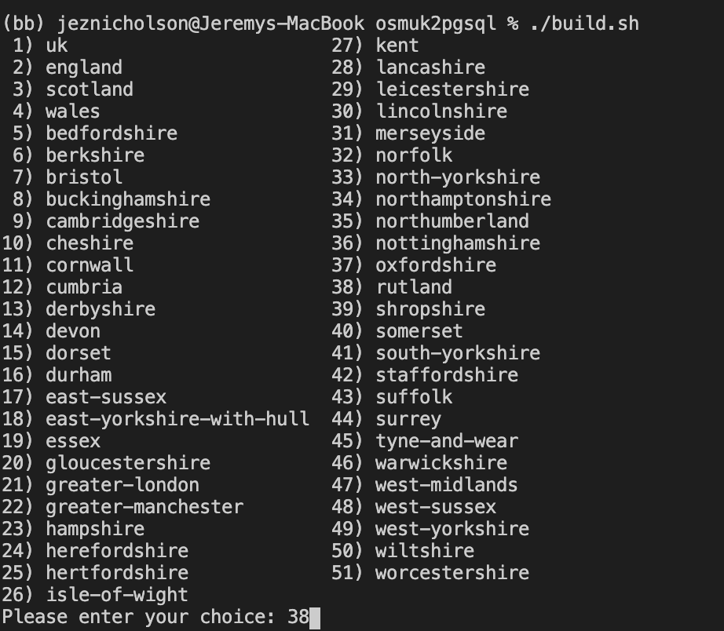

# OSMUK-in-a-box
Build a postgresql+postgis database of OpenStreetMap for the areas covered by OSMUK (the United Kingdom including Northern Ireland, the Isle of Man and Channel Islands aka the "British Islands") for use in learning, hackdays, personal projects, professional projects, etc.

## aim
A quick and easy way for someone with some technical skills but limited experience of OSM to set up a UK database for hacking with. Self-contained and operating system independent.

A minimal tile server and map view is included to help you get started. Other systems (Mapnik, etc.) may be installed independently and pointed at this database.

## rationale
When asked,
> "What Open Data is there in the UK that could be used in a hackday?"

I like to reply,

> "The richest source of geospatial data is OpenStreetMap"

> "Great! How do I set that up?"

> "Easy! Just download the latest country file and load it into postgres using one of the OSM tools... Oh, and then ignore Eire. And put some indexes on it or it'll be slow."

> "The wha?...(Thanks, but I probably won't bother)"

## architecture
Latest stable Postgresql database with Postgis.

Python 3.

Data is from a subset extracted by Geofabrik. Their definition of 'Great Britain' is a rough polygon around the British mainland, the island or Ireland, and the Channel Islands. SQL is included to remove Eire features so that counts, etc. are correct for the OSMUK area. Currently undecided on whether to retain the complete coastline of Ireland.

A minimal vector tile server and example Mapbox GL map.

The first version is a bash shell script. As a prerequisite it requires postgresl, postgis, hstore, osm2pgsql, wget and unzip to be installed. The script could install stuff for you but it gets complicated coping with Linux, Windows, Mac OS X, etc.

Second version will most likely use Docker.

## alternatives
Explore OSM data quickly using country-specific Taginfo pages from Geofabrik:

* http://taginfo.geofabrik.de/europe/great-britain/
* http://taginfo.geofabrik.de/europe/great-britain/england/
* http://taginfo.geofabrik.de/europe/great-britain/england/greater-manchester/
* etc.
* http://taginfo.geofabrik.de/europe/great-britain/scotland/
* http://taginfo.geofabrik.de/europe/great-britain/wales/

https://overpass-turbo.eu/ allows for more complicated queries but can become overloaded if you ask for the whole country

## database structure
Hopefully, you know a little about how raw OSM data is structured using nodes, ways, relations, and key-value pairs of tags. If this were loaded into a relational database it would not be a very queryable table structure, as much of the data is stuffed into the 'tags' column. Yes, you can select tags->'public_transport' but the query will be slow.

e.g.
* osm_id: [13893359](https://www.openstreetmap.org/node/13893359)
* tags: ""train"=>"yes", "network"=>"National Rail", "ref:crs"=>"CTF", "wikidata"=>"Q2401174", "wikipedia"=>"en:Catford railway station", "source_ref"=>"http://en.wikipedia.org/wiki/List_of_London_railway_stations", "wheelchair"=>"no", "naptan:AtcoCode"=>"9100CATFORD", "public_transport"=>"station""
* way (geometry): "0101000020110F000066F2CB167ABEA6C06ACF65C3418F5941"

When we render a map from the data there are standard tags and values that we are looking for. Running osm2pgsql will expand out some of the tags into columns of their own and apply various rules. This makes it far easier to write SQL queries. The tags that are wanted are defined in the openstreetmap-carto-master/openstreetmap-carto.style document.

* osm_id: 13893359
* access: nil
* addr:housename: nil
* ....
* list of columns
* ....
* name: Catford
* railway: station
* ....
* list of columns
* ....
* tags: ""train"=>"yes", "network"=>"National Rail", "ref:crs"=>"CTF", "wikidata"=>"Q2401174", "wikipedia"=>"en:Catford railway station", "source_ref"=>"http://en.wikipedia.org/wiki/List_of_London_railway_stations", "wheelchair"=>"no", "naptan:AtcoCode"=>"9100CATFORD", "public_transport"=>"station""
* way (geometry): "0101000020110F000066F2CB167ABEA6C06ACF65C3418F5941"

## Vector tile server
Based on Paul Ramsey's https://github.com/pramsey/minimal-mvt this is a minimal vector tile server

```sh
virtualenv --python python3 venv
source venv/bin/activate
pip install -r requirements.txt
```

Run with
```sh
python3 minimal-mvt.py
```

{:height="50%" width="50%"}

## Running
./build.sh

